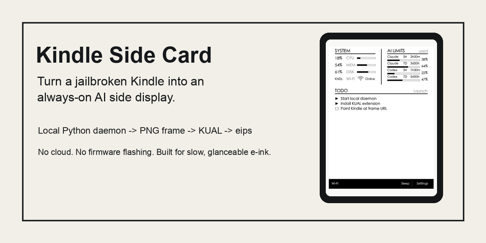
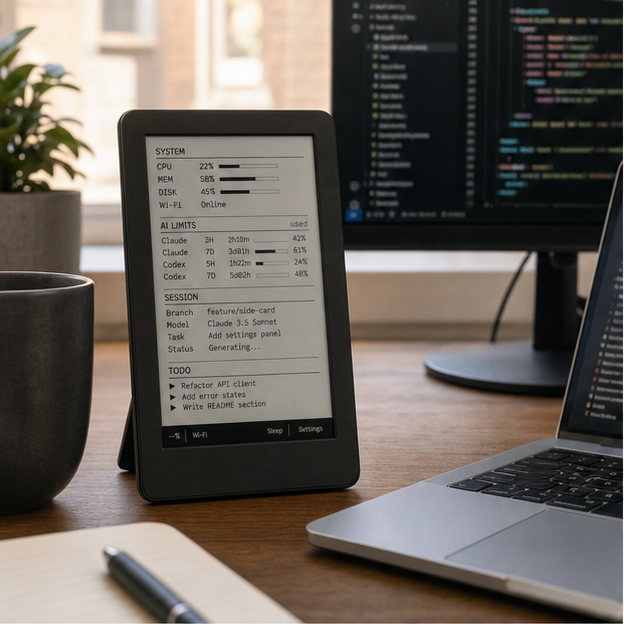
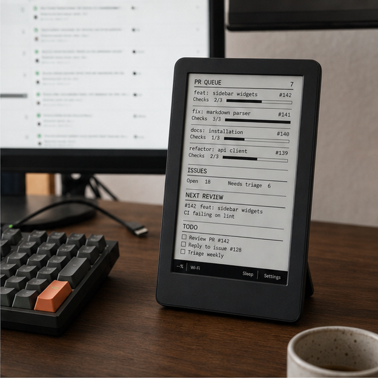
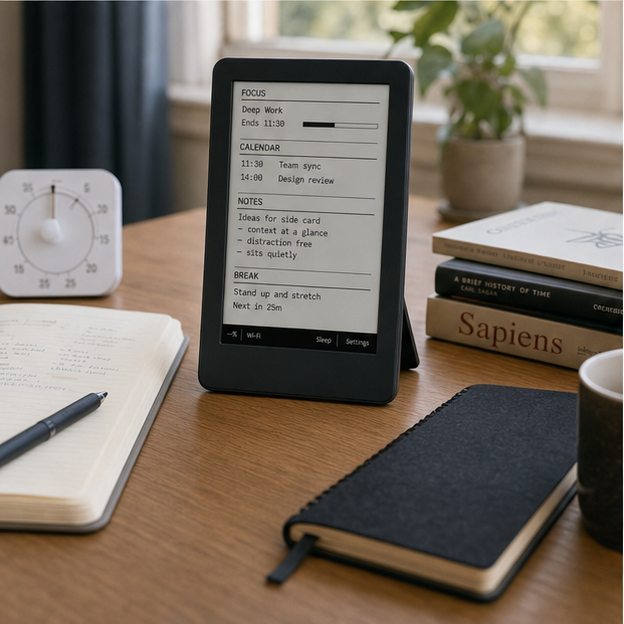
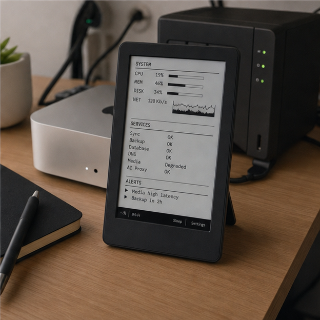
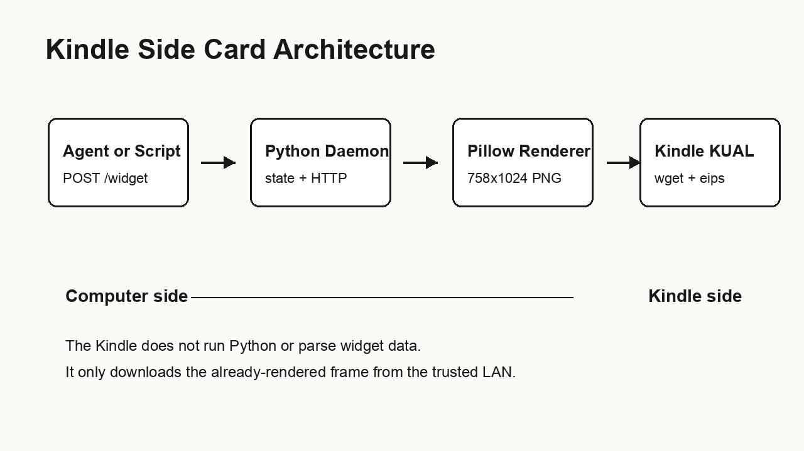

# Kindle Side Card

Turn a jailbroken Kindle into a local e-ink side display.

[](LICENSE)
[](#experimental)



Preview image is generated from the renderer.

Kindle Side Card is a local-first e-ink dashboard for an old Kindle. A Python
daemon renders a 758x1024 PNG on your computer, and a KUAL extension on the
Kindle pulls that frame over Wi-Fi and paints it with `eips`.

## Why This Exists

A browser dashboard is still a browser. It is bright, interactive, and one click
away from another tab.

Kindle Side Card is intentionally weaker: slow e-ink, fixed layout, local
network, glanceable information. That makes it a better place for ambient state
that should stay visible without becoming another app to manage.

Good fit:

- developers using AI agents who want a physical status surface
- people with an old jailbroken Kindle sitting unused
- e-ink and local-first dashboard experiments
- low-distraction desks where a small OLED screen would be too loud

## What Works Today

- Native Kindle Paperwhite 1 / 5th generation resolution: 758x1024.
- Local HTTP daemon with `GET /kindle/frame.png`, `POST /widget`, `GET /heartbeat`, and page switching endpoints.
- KUAL extension with Start, Stop, Refresh Once, Previous Page, and Next Page actions.
- Generic widgets inherited from the original ai-desk-card renderer: system, todo, calendar, AI limits, scratch, messages, PR queue, deadlines, and more.
- Conservative repaint loop that keeps re-drawing the cached frame so the Kindle home screen is less likely to cover the dashboard.

## Use-Case Gallery

These concept scenes show target workflows. They are not real device photos.

| Coding workflow | Open-source triage |
|---|---|
|  |  |

| Deep work dashboard | Homelab system monitor |
|---|---|
|  |  |

## Experimental

- Kindle models beyond PW1 are not verified yet.
- Touch/swipe control is off by default because some Kindle home screens receive the tap underneath KUAL.
- Jailbreak, KUAL, and MRPI are prerequisites. This repo does not provide jailbreak tooling.
- AI quota widgets accept generic JSON. The repo does not scrape private Claude, Codex, or local account state.
- It is not a polished consumer product. Expect setup friction.

## Quick Start

```bash
git clone https://github.com/perduewu-ops/kindle-side-card.git
cd kindle-side-card
python3 -m venv .venv
. .venv/bin/activate
pip install -r requirements.txt
python daemon/kindle_daemon.py --host 0.0.0.0 --port 9878
```

In another terminal, push demo content:

```bash
python examples/push-demo-widgets.py
```

Open `http://127.0.0.1:9878/kindle/frame.png` to verify the rendered frame.

Then copy `kindle/kindle-side-card/` to the Kindle KUAL extensions directory,
create `kindle-side-card.conf` from the example, and set:

```sh
AIDESCARD_URL="http://YOUR_COMPUTER_IP:9878/kindle/frame.png"
```

See [Install](docs/INSTALL.md) and [Kindle Setup](docs/KINDLE_SETUP.md) for the full flow.

## Architecture



```text
Agent or script -> POST /widget -> Python daemon -> PNG frame -> Kindle KUAL -> eips
```

The Kindle never runs the renderer. It only downloads an image from your local
network, which keeps the Kindle side small and easy to debug.

## API Shape

Push a widget:

```bash
curl -X POST http://127.0.0.1:9878/widget \
  -H 'Content-Type: application/json' \
  -d '{
    "slot": "main",
    "type": "todo",
    "data": {
      "title": "Today",
      "items": [
        {"text": "Ship public repo", "tag": "today"},
        {"text": "Collect Kindle photos", "tag": "next"}
      ]
    }
  }'
```

Inspect state:

```bash
curl http://127.0.0.1:9878/heartbeat
curl http://127.0.0.1:9878/widget
```

## Attribution

Kindle Side Card is a GPL-3.0 derivative of
[op7418/ai-desk-card](https://github.com/op7418/ai-desk-card), created by
[`op7418`](https://github.com/op7418). The original project targets M5Paper
devices. This repo extracts and adapts the Python renderer/daemon path for a
jailbroken Kindle target.

Thank you to `op7418` for publishing ai-desk-card as open source and for
creating the renderer, daemon, and e-ink side-display ideas that made this
Kindle experiment possible.

Visible attribution to `op7418 / ai-desk-card` is preserved in
[NOTICE.md](NOTICE.md) and [LICENSE](LICENSE).

## License

GPL-3.0-only. See [LICENSE](LICENSE) and [NOTICE.md](NOTICE.md).
